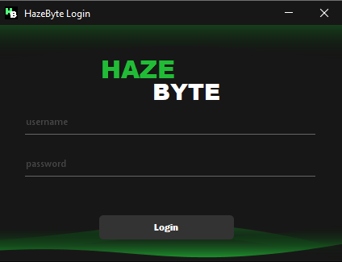
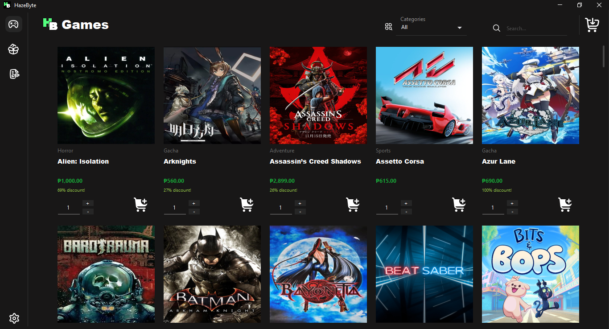
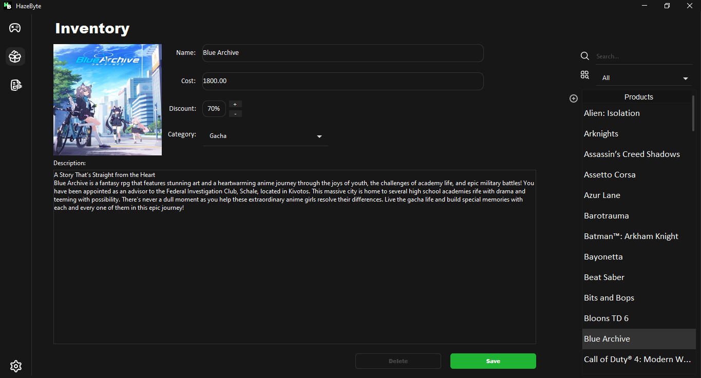
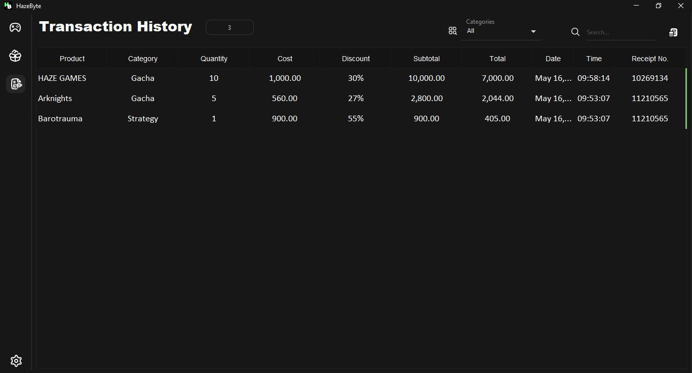
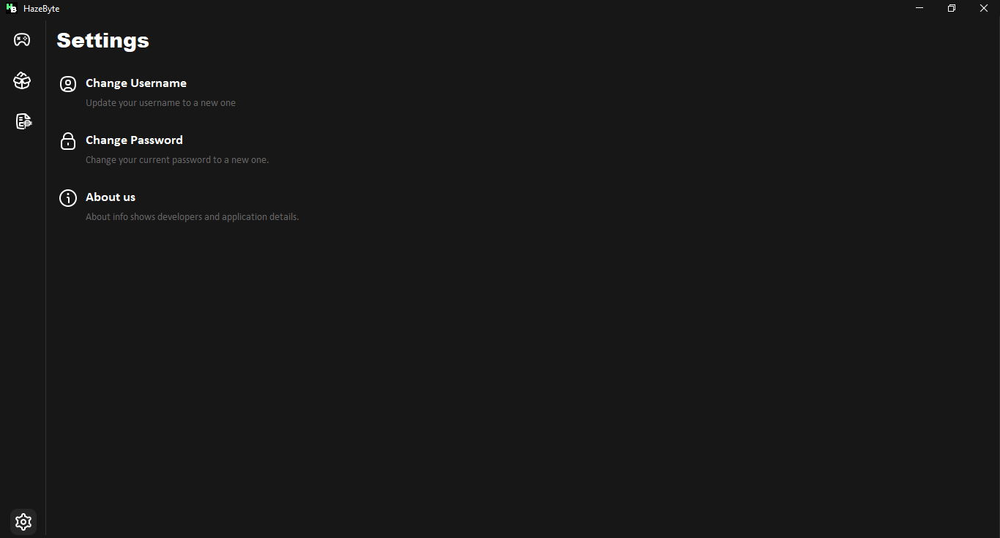
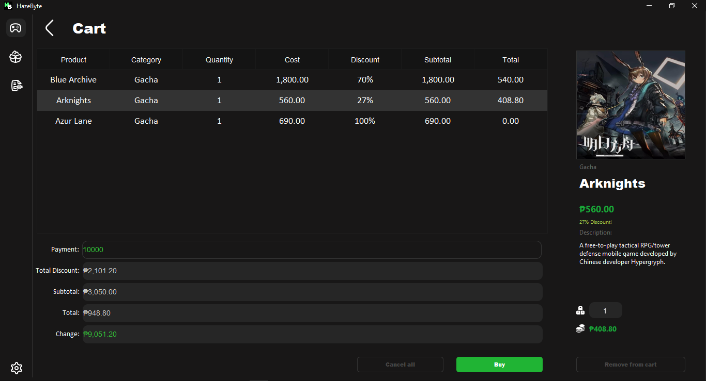
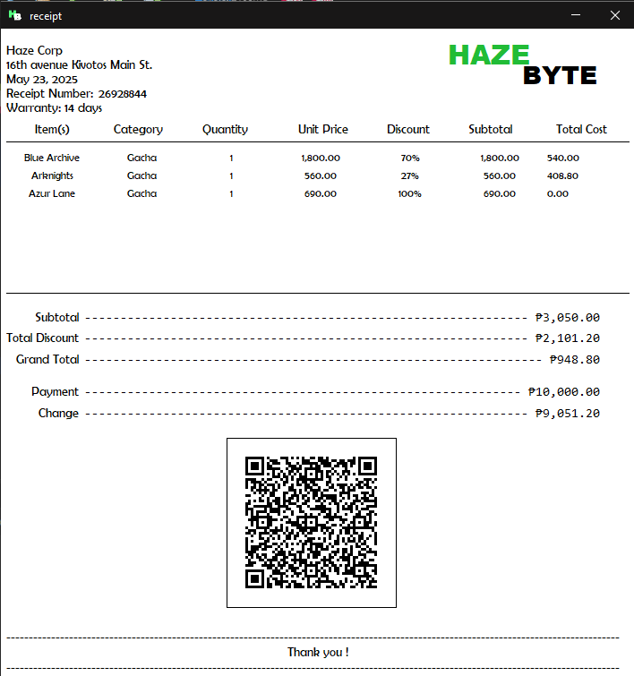

  

<h2>Description</h2>

A Java-based Game Shop application created using Swing GUI and SQL database integration using Xampp.

<h2>How it works</h2>

<h3>Login</h3>

Login for added security to the application.

<h3>Home</h3>

View the available games in the home panel.

<h3>Inventory</h3>

Manage your products by adding, editing, and deleting them.

<h3>Transaction</h3>

Track your transaction history in the transaction panel.

<h3>Settings</h3>

configure settings in the settings panel.

<h3>Cart</h3>

Proceed with the transaction by inputting payment in cart panel and buying the selected products.

<h3>Receipt</h3>

View the bought products with a receipt.

