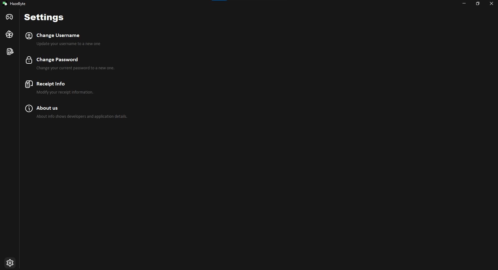

  

## Description
A Java-based Game Shop application created using Swing GUI and SQL database integration using Xampp.

## Features

### Login

Login for added security to the application.

### Home

View the available games in the home panel.

### Inventory

Manage your products by adding, editing, and deleting them.

### Transaction

Track your transaction history in the transaction panel.

### Settings

configure settings in the settings panel.

### Cart

Proceed with the transaction by inputting payment in cart panel and buying the selected products.

### Receipt

View the bought products with a receipt.

## Requirements
- Java JDK
- Java IDE (preferably netbeans)
- xampp sql database

 
